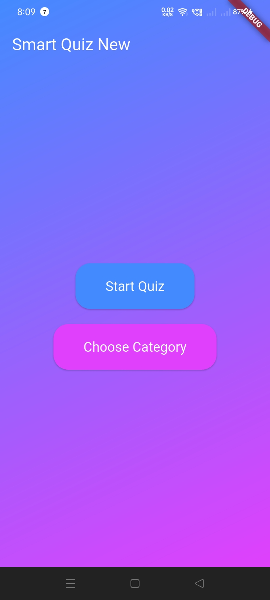

Smart Quiz App
A Flutter-based quiz application that allows users to test their knowledge with interactive quizzes. Features include animations using flutter_animate, persistent storage with shared_preferences, and a clean UI.
Features

Interactive quiz with multiple-choice questions
Animations for correct/incorrect answers using flutter_animate
Persistent storage of user preferences
Responsive design with Material Design

Tech Stack

Frontend: Flutter, Dart
Packages: flutter_animate, shared_preferences, audioplayers, path_provider, share_plus
Tools: Android Studio, Git

Installation

Clone the repository:git clone https://github.com/armanborkar06/smart-quiz.git

Navigate to the project folder:cd smart-quiz

Install dependencies:flutter pub get

Run the app:flutter run

Screenshots

Contributing
Feel free to fork this repository and submit pull requests for improvements.
License
MIT License
